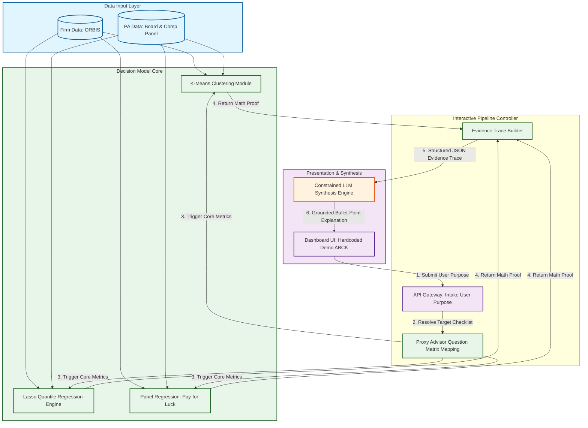

```mermaid
graph TD
    %% Styling
    classDef data fill:#e1f5fe,stroke:#01579b,stroke-width:2px;
    classDef engine fill:#e8f5e9,stroke:#1b5e20,stroke-width:2px;
    classDef llm fill:#fff3e0,stroke:#e65100,stroke-width:2px;
    classDef ui fill:#f3e5f5,stroke:#4a148c,stroke-width:2px;

    %% Data Input Layer
    subgraph Data_Inputs [Data Input Layer]
        A[(Firm Data: ORBIS)]:::data
        B[(PA Data: Board & Comp Panel)]:::data
    end

    %% Analytics & Inference Core
    subgraph DM_Engine [Decision Model Core]
        C[K-Means Clustering Module]:::engine
        D[Lasso Quantile Regression Engine]:::engine
        E[Panel Regression: Pay-for-Luck]:::engine
    end

    %% Interactive State Core
    subgraph Backend_Control [Interactive Pipeline Controller]
        F[API Gateway: Intake User Purpose]:::ui
        G[Proxy Advisor Question Matrix Mapping]:::engine
        H[Evidence Trace Builder]:::engine
    end

    %% Narrative & Presentation Layer
    subgraph Presentation_Layer [Presentation & Synthesis]
        I[Constrained LLM Synthesis Engine]:::llm
        J[Dashboard UI: Hardcoded Demo ABCK]:::ui
    end

    %% Data Flow Connections
    A & B --> C
    A & B --> D
    A & B --> E
    
    %% User Interactive Loop Flow
    J -->|1. Submit User Purpose| F
    F -->|2. Resolve Target Checklist| G
    G -->|3. Trigger Core Metrics| D & E & C
    D & E & C -->|4. Return Math Proof| H
    H -->|5. Structured JSON Evidence Trace| I
    I -->|6. Grounded Bullet-Point Explanation| J

    class Data_Inputs data;
    class DM_Engine engine;
    class Presentation_Layer ui;
```
